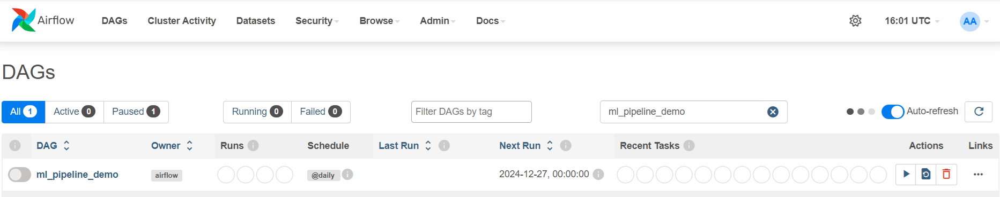
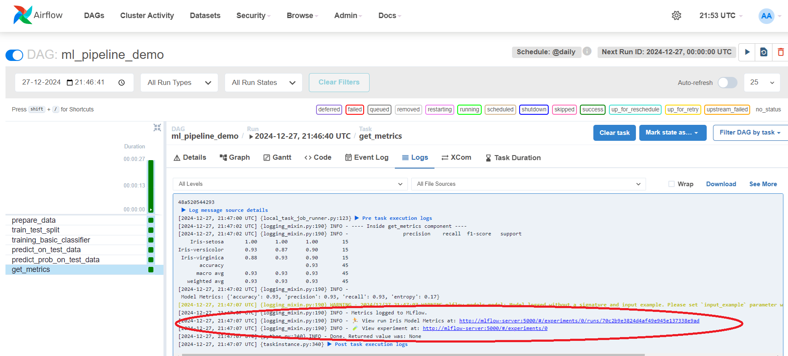
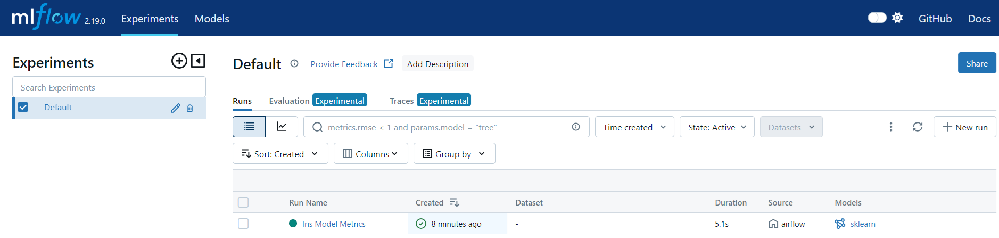
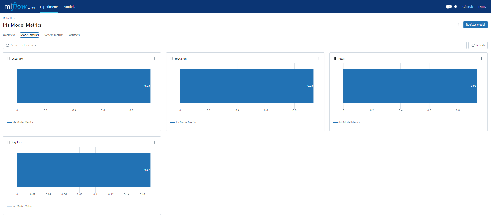
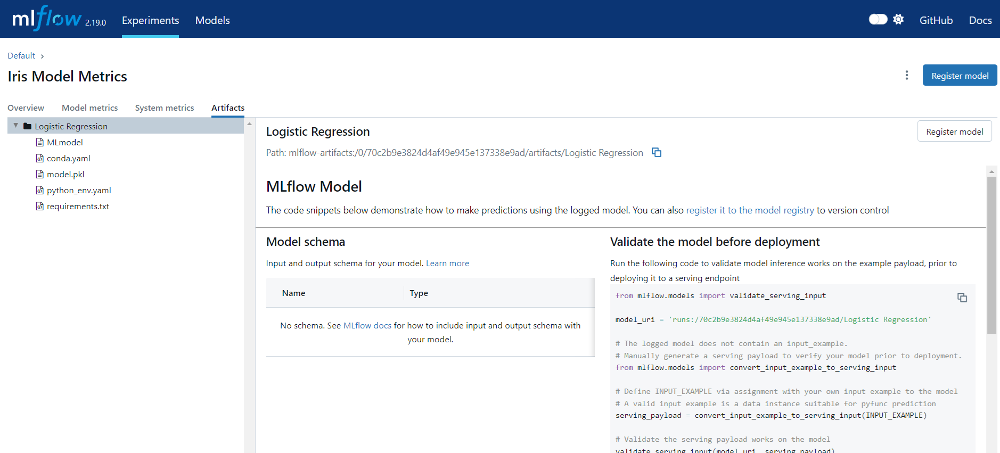

# Airflow With Docker Compose

## Pre-Requisites:
- Install docker
- Install docker-compose

## Install docker 

```shell
yum install docker -y
service docker start
service docker status
```

## Install docker-compose

```shell
curl -SL https://github.com/docker/compose/releases/download/v2.32.0/docker-compose-linux-x86_64 -o /usr/local/bin/docker-compose
chmod +x /usr/local/bin/docker-compose
docker-compose version
```

## Create directories with below command

```shell
mkdir -p ./dags ./logs ./plugins ./config
echo -e "AIRFLOW_UID=$(id -u)" > .env
```

For other operating systems, you may get a warning that AIRFLOW_UID is not set, but you can safely ignore it. You can also manually create an .env file in the same folder as docker-compose.yaml with this content to get rid of the warning:

```shell
AIRFLOW_UID=50000
```

## Setup Airflow with postgres using docker-compose

```shell
docker-compose up -d
```

```Note:``` 
1. Please check directory and file permissions using below commands
2. Here modules need to add under ```requirements.txt``` file and then restart airflow

```shell
chmod 777 dags
chmod 777 plugins
chmod 777 logs
chmod 777 config
```

## Login to Airflow

```shell
# Default credentials
username: airflow
password: airflow
```


## Checking mlops pipeline under airflow



## Log metrics to ML Flow

```py
# Log metrics to MLflow
mlflow.set_tracking_uri("http://mlflow-server:5000")  # Replace with your MLflow tracking server URI
mlflow.set_experiment("Default")        # Replace with your experiment name

with mlflow.start_run(run_name="Iris Model Metrics"):
    mlflow.log_metric("accuracy", acc)
    mlflow.log_metric("precision", prec)
    mlflow.log_metric("recall", recall)
    mlflow.log_metric("log_loss", entropy)
    with open(f'model.pkl', 'rb') as f:
        logistic_reg_model = pickle.load(f)
    mlflow.sklearn.log_model(logistic_reg_model, "Logistic Regression")
    print("Metrics logged to MLflow.")
```

After running dag:



## Check MLFlow page



## Check MLFlow Model Metrics



## Check MLFlow Artifacts Storage


