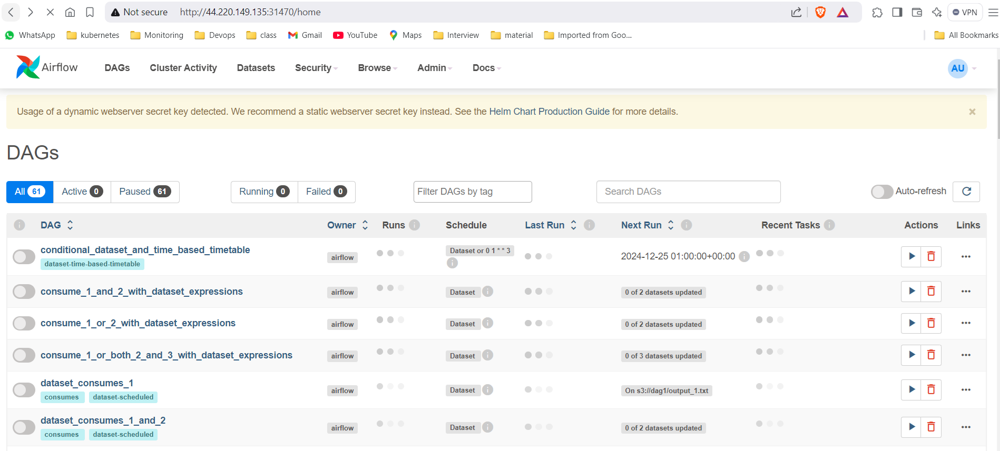
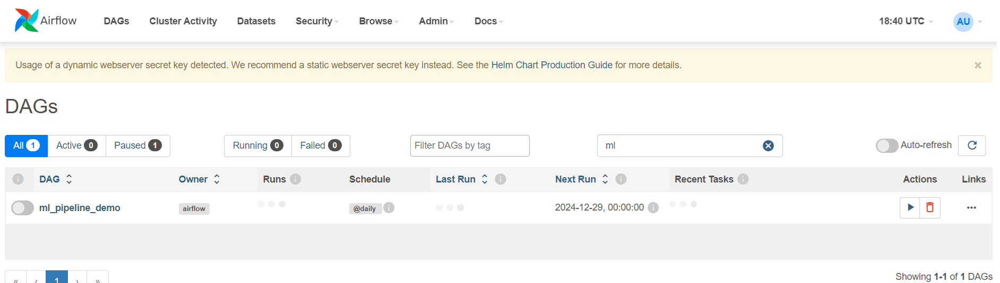
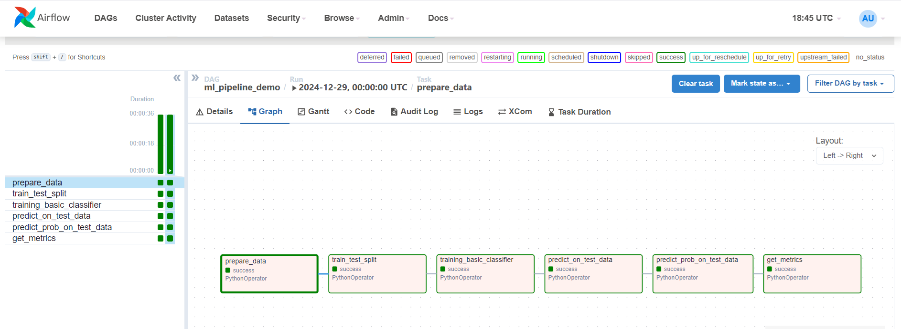

# Airflow on Minikube

## Pre-Requisites:
- Install Kubectl
- Install Docker
- Minikube Setup
- Install Helm
- Add dependencies to Repo

## Install Kubectl

```shell
curl -o kubectl https://amazon-eks.s3-us-west-2.amazonaws.com/1.14.6/2019-08-22/bin/linux/amd64/kubectl
chmod +x ./kubectl
mv kubectl /usr/bin
kubectl version --short --client
```

## Install docker

```shell
yum install docker -y
service docker start
```

## Minikube setup

```shell
curl -Lo minikube https://github.com/kubernetes/minikube/releases/download/v1.25.2/minikube-linux-amd64
chmod +x minikube
sudo mv minikube /usr/bin/
yum install conntrack -y
minikube start --driver=none
```

## Install Helm

```shell
curl -fsSL -o get_helm.sh https://raw.githubusercontent.com/helm/helm/main/scripts/get-helm-3
chmod 700 get_helm.sh
./get_helm.sh
```

## Add packages to dependency directory using below command

```shell
## Airflow having python3.12 version, so need to create packages with same version

## Install python3.12 and pip3.12 version
yum install python3.12 -y
yum install python3.12-pip -y

## Install modules and push to dependency directory
pip3.12 install -r requirements.txt -t dependencies --upgrade

## Push this dependencies to below git repo
## https://github.com/Naresh240/mlops-pipeline-dags.git
```

## Setup Airflow on minikube using helm

```shell
helm repo add apache-airflow https://airflow.apache.org
helm upgrade --install airflow apache-airflow/airflow --namespace airflow --create-namespace -f values.yaml
```

## Check pods and services

```shell
kubectl get pods -n airflow
kubectl get svc -n airflow
```

Copy port number from airflow-webserver service and enable under security group

## Access Airflow with nodeport port number



## Check Ml pipeline dag and run




